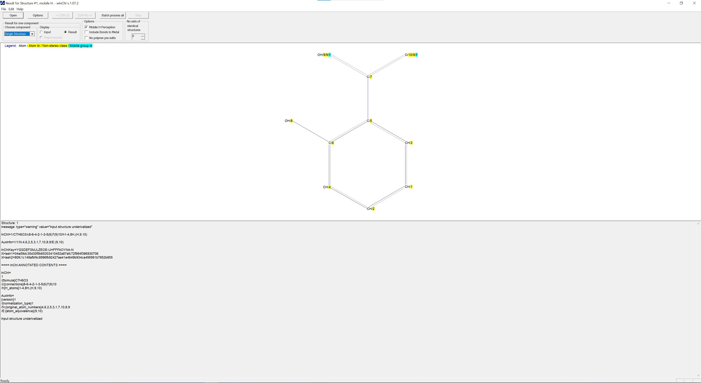

  

# wInChI - GUI software for calculation of IUPAC International Chemical Identifiers (InChIs)

<strong>wInChI</strong> is a _64-bit_ <code>GUI</code> software for <code>Microsoft&reg; Windows</code> platforms designed to: 
- calculate <strong>InChI</strong> structure-based chemical identifiers, i.e. <strong>InChI</strong> strings, keys and auxilliary information (<code>AuxInfo</code>)
- visually represent input chemical structures.

Until <strong>InChI</strong> version <code>v.1.07.0</code>, <strong>wInChI</strong> was an integral part of <strong>InChI</strong> software, but is now being developed as an individual project.
At the same time, <code>wInChI</code> will be regularly updated with every new release of <code>InChI</code> software.

<strong><a href="https://en.wikipedia.org/wiki/International_Chemical_Identifier">InChI</a></strong> is a structure-based textual identifier, strictly unique, non-proprietary, open source, and freely accessible, whose identifiers describe chemical substances in terms of layers of information – the atoms and their bond connectivity, tautomeric information, isotope information, stereochemistry, and electronic charge.

<em><figure>
  
  <figcaption><strong>Figure 1.</strong> Aspirin&reg; represented in <strong>wInChI</strong> with generated <strong>InChI</strong> string, key and auxiliary information (<code>AuxInfo</code>).</figcaption>
</figure></em>

  
More detailed information about the <strong>InChI</strong> software, including its source code and binaries/APIs, can be found at <a href="https://github.com/IUPAC-InChI/InChI/">InChI GitHub repository</a>.

Please check the cross-platform <a href="https://github.com/IUPAC-InChI/InChI-Web-Demo">InChI Web Demo</a>, a web-based `GUI` for calculation of <strong>InChI</strong> strings and keys from chemical structures' visual depictions.

## wInChI release notes

- <em>Version 1.07.2</em> (19/01/2025):
  - First version of <strong>wInChI</strong> which is entirely built using <code>Microsoft&reg; Windows API</code>, <code>Microsoft&reg; MFC</code> and <code>Microsoft&reg; MSVC compiler</code>.
  - Supports <strong>InChI</strong> versions <code>1.07.2</code> as well as <code>1.06</code> (once provided with the source code of corresponding <strong>InChI</strong> version in <code>INCHI-1-SRC</code> folder). Please refer to <a href="compiling-from-source"> compiling from source</a>.

## Using precompiled binaries

<em>64-bit</em> precompiled binary (executable) is located in the following folder: <code>WINCHI-BIN/windows/64bit/winchi-1.exe</code>.
It can be run on <code>Microsoft&reg; Windows</code> platforms by double-clicking the executable `winchi-1.exe` as there are no dependencies on any external libraries.

## Compiling from source

- Since <strong>wInChI</strong> was developed using <code>Microsoft&reg; Windows API</code> and <code><a href="https://en.wikipedia.org/wiki/Microsoft_Foundation_Class_Library">Microsoft&reg; MFC</a></code>, the <ins>only</ins> compiler which can be used to successfully build <strong>wInChI</strong> is <code>Microsoft&reg; Visual C++ (MSVC)</code>.
- <code>Microsoft&reg; Visual Studio</code> solution <code>wIChI.sln</code> is located in the root of the <code><a href="wIChI">wIChI</a></code> folder, and consists of two projects:
  - main <code>wIChI</code> project with source code files located in <code><a href="wIChI/src/">wIChI/src</a></code> folder
  - supporting <code>IChI_lib</code> project with source code files located in <code><a href="IChI_lib/src/">IChI_lib/src</a></code> folder
- Once successfully compiled, <code>winchi-1.exe</code> executable will be located in:
  - <code>wIChI/x64_Release</code> for <code>Release</code> solution configuration 
  - <code>wIChI/x64_Debug</code> for <code>Debug</code> solution configuration.

## External links and references

- [IUPAC](https://iupac.org/)
- [InChI Trust](https://www.inchi-trust.org/)
